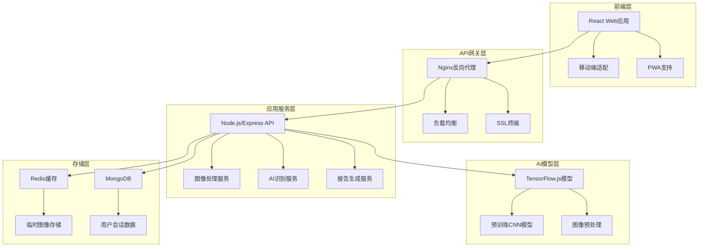
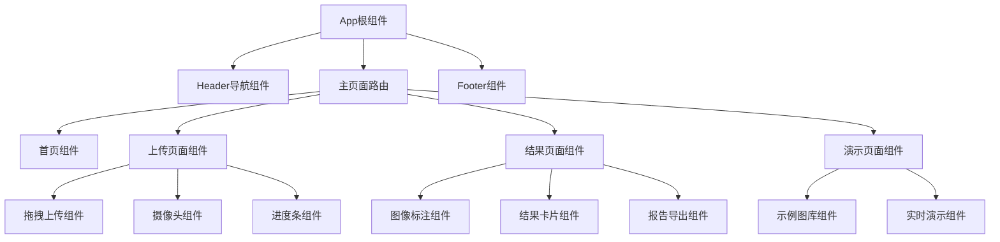
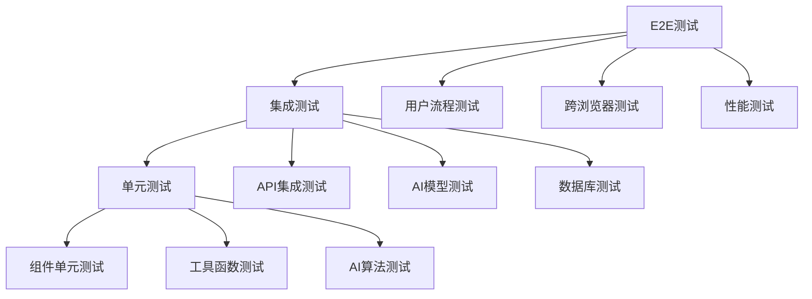
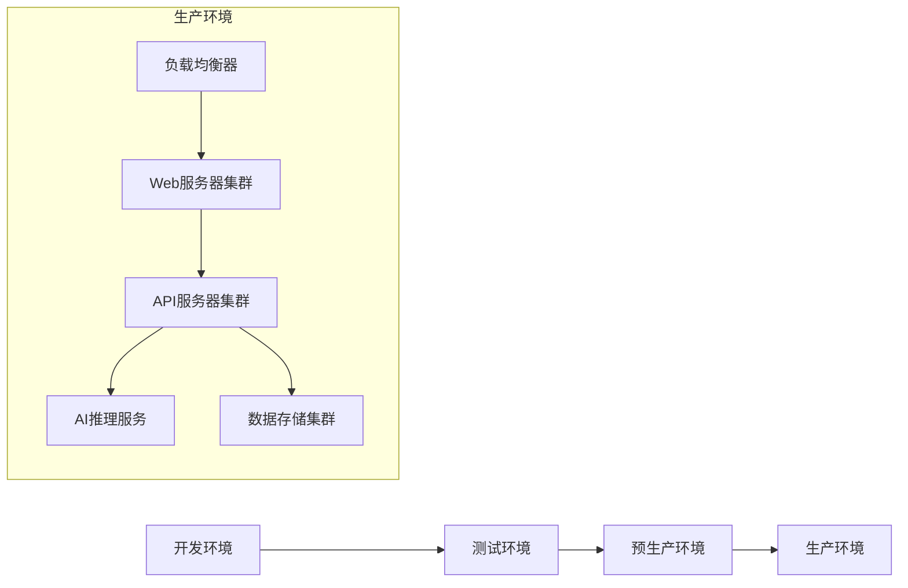

# 光伏图像识别演示网站设计文档

## 概述

本设计文档描述了一个现代化、高端、工业化的光伏图像识别演示网站的技术架构和实现方案。系统采用前后端分离架构，结合先进的AI图像识别技术，为光伏行业提供智能化的监测和诊断解决方案。

## 架构设计

### 系统架构图



### 技术栈选择

**前端技术栈：**
- React 18 + TypeScript - 现代化组件开发
- Tailwind CSS - 工业化UI设计系统
- Framer Motion - 流畅动画效果
- React Query - 数据状态管理
- Vite - 快速构建工具

**后端技术栈：**
- Node.js + Express - 高性能API服务
- TypeScript - 类型安全开发
- Multer - 文件上传处理
- Sharp - 图像处理优化
- Helmet - 安全中间件

**AI/ML技术栈：**
- TensorFlow.js - 浏览器端AI推理
- OpenCV.js - 图像预处理
- 自定义CNN模型 - 光伏板状态分类
- WebGL加速 - 提升推理性能

## 组件和接口设计

### 前端组件架构



### API接口设计

**图像上传接口**
```typescript
POST /api/upload
Content-Type: multipart/form-data

Request:
- file: File (图像文件)
- sessionId?: string (会话ID)

Response:
{
  success: boolean,
  data: {
    imageId: string,
    originalUrl: string,
    thumbnailUrl: string,
    metadata: {
      size: number,
      dimensions: { width: number, height: number },
      format: string
    }
  }
}
```

**AI识别接口**
```typescript
POST /api/analyze
Content-Type: application/json

Request:
{
  imageId: string,
  options?: {
    confidence: number,
    detailLevel: 'basic' | 'detailed'
  }
}

Response:
{
  success: boolean,
  data: {
    results: Array<{
      category: 'normal' | 'leaves' | 'dust' | 'shadow' | 'other',
      confidence: number,
      boundingBox: { x: number, y: number, width: number, height: number },
      description: string,
      severity: 'low' | 'medium' | 'high'
    }>,
    processingTime: number,
    recommendations: string[]
  }
}
```

## 数据模型

### 图像数据模型
```typescript
interface ImageData {
  id: string;
  originalName: string;
  url: string;
  thumbnailUrl: string;
  metadata: {
    size: number;
    dimensions: { width: number; height: number };
    format: string;
    uploadTime: Date;
  };
  sessionId: string;
  expiresAt: Date;
}
```

### 识别结果模型
```typescript
interface AnalysisResult {
  imageId: string;
  results: DetectionResult[];
  summary: {
    overallStatus: 'healthy' | 'warning' | 'critical';
    totalIssues: number;
    processingTime: number;
  };
  recommendations: Recommendation[];
  createdAt: Date;
}

interface DetectionResult {
  category: PanelCondition;
  confidence: number;
  boundingBox: BoundingBox;
  description: string;
  severity: Severity;
}
```##
 错误处理

### 错误分类和处理策略

**客户端错误处理：**
```typescript
enum ErrorType {
  NETWORK_ERROR = 'NETWORK_ERROR',
  VALIDATION_ERROR = 'VALIDATION_ERROR',
  FILE_TOO_LARGE = 'FILE_TOO_LARGE',
  UNSUPPORTED_FORMAT = 'UNSUPPORTED_FORMAT',
  AI_PROCESSING_ERROR = 'AI_PROCESSING_ERROR'
}

interface ErrorResponse {
  success: false;
  error: {
    type: ErrorType;
    message: string;
    details?: any;
    retryable: boolean;
  };
}
```

**错误恢复机制：**
1. 自动重试机制 - 网络错误和临时服务错误
2. 降级服务 - AI服务不可用时提供基础功能
3. 用户友好提示 - 清晰的错误信息和解决建议
4. 错误日志记录 - 完整的错误追踪和监控

### 性能优化策略

**前端优化：**
- 图像压缩和预处理
- 懒加载和代码分割
- Service Worker缓存
- WebP格式支持
- 响应式图像加载

**后端优化：**
- Redis缓存热点数据
- 图像CDN分发
- API响应压缩
- 数据库查询优化
- 负载均衡配置

**AI模型优化：**
- 模型量化和压缩
- WebGL GPU加速
- 批处理推理
- 模型预热机制
- 结果缓存策略

## 测试策略

### 测试金字塔



### 测试覆盖率目标

- 单元测试覆盖率：≥ 90%
- 集成测试覆盖率：≥ 80%
- E2E测试覆盖率：≥ 70%
- AI模型准确率：≥ 95%

### 测试工具和框架

**前端测试：**
- Jest + React Testing Library - 单元测试
- Cypress - E2E测试
- Storybook - 组件测试
- Lighthouse - 性能测试

**后端测试：**
- Jest + Supertest - API测试
- MongoDB Memory Server - 数据库测试
- Artillery - 负载测试
- Docker Compose - 集成测试环境

**AI模型测试：**
- 自定义测试数据集
- 混淆矩阵分析
- A/B测试框架
- 模型性能监控

## 安全设计

### 安全措施

**数据传输安全：**
- HTTPS/TLS 1.3加密
- HSTS安全头
- CSP内容安全策略
- CORS跨域配置

**数据存储安全：**
- 图像数据加密存储
- 自动数据清理机制
- 访问日志记录
- 数据备份和恢复

**应用安全：**
- 输入验证和清理
- SQL注入防护
- XSS攻击防护
- CSRF令牌验证
- 速率限制和防DDoS

### 隐私保护

**数据最小化原则：**
- 仅收集必要的图像数据
- 不存储个人身份信息
- 24小时自动数据删除
- 用户数据控制权限

**合规性考虑：**
- GDPR数据保护合规
- 数据处理透明度
- 用户同意机制
- 数据可携带权

## 部署和运维

### 部署架构



### 监控和告警

**系统监控指标：**
- 服务可用性和响应时间
- API请求量和错误率
- 资源使用率（CPU、内存、磁盘）
- AI模型推理性能
- 用户行为分析

**告警机制：**
- 实时告警通知
- 分级告警处理
- 自动故障恢复
- 性能阈值监控
- 安全事件检测

### 扩展性设计

**水平扩展能力：**
- 微服务架构支持
- 容器化部署
- 自动伸缩配置
- 数据库分片策略
- CDN全球分发

**垂直扩展优化：**
- GPU加速支持
- 内存优化策略
- 缓存层优化
- 数据库性能调优
- 网络带宽优化